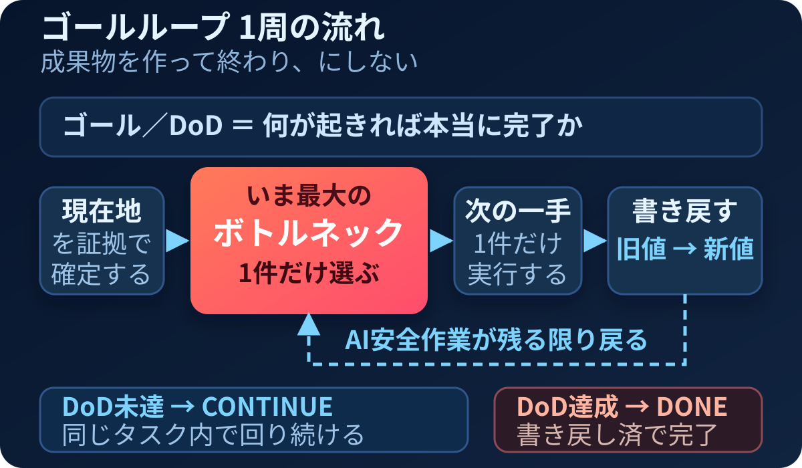
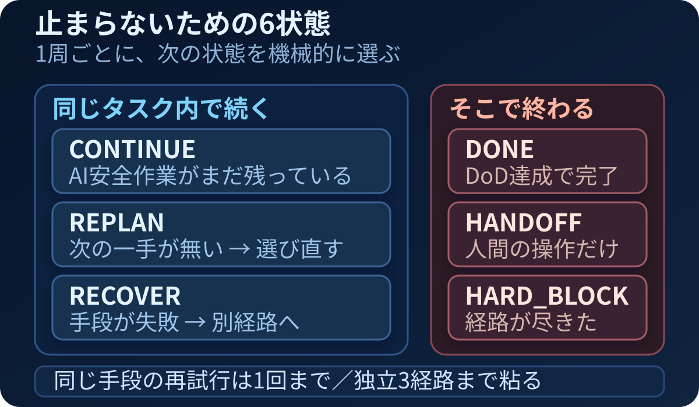

# GOAL_LOOP.md — ゴールループ標準

対象: このリポジトリを取り込んだプロジェクトで実行する**すべてのタスク**（ゴール・DoD が明示されていない依頼も含む。単発の小タスクは §12 の最小チェックリストで足りる）
位置づけ: ゴールループの**正本**。プロジェクト側に上位ルール（`AGENTS.md` / `CLAUDE.md` などのエントリポイントとその参照先）がある場合、矛盾時は上位を優先する。

## 0. 何をどこへ置くか

ゴールループの情報は、役割ごとに分ける。

- **本ファイル**: どのプロジェクトでも使うループの仕組み・判断規則・完了判定
- **`STATE`／作業ログ（標準）**: プロジェクトごとの上位ゴール、現在ゴール、現在地、DoD、次の一手、実行結果
- **外部ゴール管理ツール（任意）**: 使うと決めたプロジェクトだけ、現在地、DoD、子ゴール、実行結果を追加で管理
- **実ファイル**: コード、資料、ログ、テスト結果などの成果物と証拠
- **チャット**: その場の対話。確定事項は `STATE`／作業ログ、実ファイル、選択時の外部ゴール管理ツールへ戻し、チャットだけを正本にしない

ゴールループは外部ゴール管理ツールを必須としない。標準の保存先は、依頼範囲内のローカル `STATE`／作業ログとする。外部ゴール管理ツールは、その案件で使うと決めた場合だけ接続する任意レイヤー。タスク全体がread-onlyならローカルにも書かず、最終報告に未実施の書き戻し内容を示す。

## 1. ゴールループの目的

仕事を「成果物を作った」で止めず、次の循環を閉じる。

1. 理想の状態を捉える
2. 現在の状態を証拠で確定する
3. 理想と現在の差分を分解する
4. 最大ボトルネックを1件に絞る
5. 最小の一手を実行する
6. 結果を旧値から新値へ書き戻す
7. DoD未達なら、更新された現在地から次のループを始める

成果物は手段であり、利用・受領・業務成果が必要な仕事では、それらが確認されるまでプロジェクトは未完了。

### 二重ループと階層

- **目標達成ループ**: 現在ゴールを固定し、差分 → 最大ボトルネック → 一手 → 実行 → 書き戻しを繰り返す。通常はこちらを回す。
- **目標更新ループ**: 正しい一手を実行した結果、現在ゴールでは価値が生まれない、または前提が変わったという証拠が出た時だけ、ゴール自体を見直す。

難しい、面倒、最初の一手が失敗した、という理由だけで目標更新ループへ逃げない。更新する場合も上位ゴール全体を作り直さず、証拠で壊れた階層だけを直す。依頼範囲・費用・契約・不可逆性を実質的に変える更新は判断キューへ送り、独立したAI安全作業を続ける。

仕事が親ゴールと複数の子ループに分かれる場合、子ループの終了条件だけで親を完了にしない。子の実行結果を親の現在地へ書き戻し、親のDoDと前提を再判定する。

## 2. 用語

- **仕事**: 誰の何を、どんな状態へ変える責任か
- **上位ゴール**: このプロジェクトが、事業・顧客・生活の何に効くか
- **現在ゴール**: 今回のループで閉じる差分
- **DoD**: 本当に実現したい理想の状態。成果物だけでなく、必要なら利用・受領・業務成果を含む。複数段のプロジェクトでは上位ゴールのDoDと、現在ゴールのDoDを分ける
- **現在地**: 日付、現在値、直近の動き、判断基準、事実、証拠、情報源、不明点
- **差分**: 理想と現在の間にある未達。事実と仮説を分ける
- **最大ボトルネック**: いま最初に解消すると前進量が最大になる差分1件
- **次の一手**: 最大ボトルネックを最小コストで検証・解消する行動1件
- **書き戻し**: 実行事実、旧値から新値、証拠、前提変化を正本へ戻すこと
- **AI安全作業**: 依頼範囲内・許可済み・可逆で、AIだけで実行できる読み取り、作成、修正、検証、準備
- **soft blocker**: 一手段の失敗、任意情報の不足、人間待ちがあっても別のAI安全作業が残る状態
- **hard blocker**: AI安全作業が0件で、未承認の保護操作、必須資格情報・物理機器、安全な代替経路のいずれもAIが解消できず、実行者と行動が明確な人間ハンドオフにも落とせない状態

### 現在地の精度

現在地は、次の3点を最低限そろえる。

1. **数字**: 2〜3日で動く現在値。不明なら推定せず「不明」と、確認できる在り処を記録
2. **直近の動き**: 最後に何を実行し、何が返ったか。完了済み作業のやり直しと同じ提案の反復を防ぐ
3. **判断基準**: 案の採否を左右する恒久的な条件。確認済みの暗黙知だけを書き、単発事情や推測を混ぜない

## 3. 開始時に必ず復唱する9項目

1. **仕事**: 誰の何を、どう変える仕事か
2. **上位ゴール**: 何に接続するか
3. **現在ゴール**: 今回閉じる差分は何か
4. **DoD**: 何が起きれば本当に完了か
5. **現在地**: 日付、現在値、直近の動き、判断基準、証拠、情報源
6. **差分**: 事実／仮説／不明を分けた未達
7. **最大ボトルネック**: いま最重要の1件
8. **次の一手**: 行動1件と更新する数字
9. **書き戻し先**: `STATE`／作業ログ、実ファイル、必要に応じて外部ゴール管理ツールの対象ゴール

情報が無ければ「不明」と書く。別の情報源が食い違う場合は、黙って統合せず両方を残す。
この復唱は作業ログへ残すための内部ゲートであり、承認待ちのための停止点ではない。依頼範囲内で軽微・可逆なら、暫定DoDと仮定を記録して着手する。

## 4. 情報の確認順

1. `AGENTS.md` または `CLAUDE.md`（正本へのエントリポイント）
2. プロジェクトの上位ルール正本（あれば）
3. 本ファイル
4. プロジェクト固有のルール、参照を許可されたknowledge、`STATE`／作業ログ
5. 外部ゴール管理ツールを使う案件だけ、対象ゴール、DoD、詳細、子ゴール、Goalメモリ
6. 実ファイル、実行ログ、テスト結果
7. 当該チャットの確定発言
8. 必要な外部一次情報

同じマウントやキャッシュを別コマンドで読んだだけなら、独立した検証とは扱わない。

### コンテキストの採用条件

- 正本は1つに定め、コピーやスクリーンショットは取得時点のスナップショットとして扱う。可能なら原本の在り処とファイル名を記録する
- 情報源ごとに最終更新、想定更新頻度、更新者または確認先を持つ。不明なら空欄にせず「不明」とする
- 今回のゴールと判断に必要な最小範囲だけを読む。大量に渡すこと自体をコンテキスト品質と混同しない
- 参照を許可されたプロジェクト固有knowledgeは判断材料であり、上位のプロジェクトルールおよび本ファイルと衝突する旧記述を実行規範に昇格させない

## 5. 最大ボトルネックの選び方

候補ごとに次を確認し、1件だけ選ぶ。

- DoDを直接止めているか
- 存在を示す証拠があるか
- 解消すると後続作業が複数開くか
- 安く、速く、可逆な検証方法があるか
- AIだけで解消できるか、人間の操作が必要か

「重要そう」「気になる」だけでは選ばない。全残作業を同じ優先度で並べるのも禁止。
最大ボトルネックが人間専用でも、独立したAI安全作業が残る場合は人間待ちを判断キューへ移し、AIが解消できる最大差分をその周回のボトルネックとして選び直す。

差分は候補の段階では仮説であり、進行を止めている証拠が出て初めてボトルネックとして採用する。仮説が未確定なら、成果物を先に作るより、仮説を確定・棄却できる最小コストの確認を優先する。証拠へアクセスできない場合は「情報源へアクセスできないこと」をボトルネック候補にする。

検証済みの締切が支配的で、探索の遅延がDoDを直接損なう場合は、追加探索より期限内の安全な実行を優先する。未検証の緊急感だけではこの例外を使わない。

## 6. 外部ゴール管理ツールを使う場合の落とし方（任意）

外部ゴール管理ツールを使う案件では次の対応を守る。使わない案件は本節を飛ばしてよい。

- `description` = 現在の状態
- `definition_of_done` = 理想の状態
- 子ゴール = 理想と現在の差分を閉じる具体的アクション
- Goal詳細 = 恒久的な仕様、証拠、手順、情報の地図
- Goalメモリ = 後続作業に必要な意思決定・発見・進捗の差分

親をAIだけで完了できない場合:

1. AIが完了した範囲を子ゴールとして証拠付きで完了する
2. 対外送信、本人確認、決裁、契約、顧客操作は人間ハンドオフ子ゴールにする
3. 親はDoDが満たされるまで完了しない

### 組織スコープの確認

外部ツールへ書く前に、書き込み先が本当に意図した先かを次の2項目で比較する。

- 対象ゴールが属する組織・ワークスペースの ID
- いま接続しているセッションの組織・ワークスペースの ID

一致しない場合、組織指定を持たない作成操作は別の組織へ保存される可能性がある。作成後は必ず、対象組織のツリー、テンプレート使用回数、子ゴール件数を読み戻す。

次の状態は、外部ゴール管理ツールへの保存自体が成功していても、**対象ゴールへの適用・運用実装は完了していない**。

- テンプレートは存在するが使用回数0
- ゴール詳細に子ゴール案を書いただけで、実際の子ゴールは0件
- 別組織に作成され、対象ゴールから参照・適用できない
- 権限エラー後も、本文に設計を書いたことを「実装」と呼ぶ

## 7. 実行ループ

1. 最大ボトルネックを1件選ぶ
2. 旧値を記録する
3. 次の一手を1件実行する
4. 成功・失敗・未確認を証拠で判定する
5. 新値を記録する
6. DoDと上位ゴールの前提が変わったか確認する
7. 開始時に決めた書き戻し先へ戻す
8. DoD未達なら次の最大ボトルネックを選ぶ

「次の一手1件」は1周の粒度であり、1タスクを1周で終える意味ではない。**AI安全作業が残る限り**、8から1へ同一タスク内で自動的に戻る。各周回で次の状態を機械的に選ぶ。

1. `DONE`: DoDを証拠で確認し、許可された書き戻しも完了。タスク全体がread-onlyなら、書き戻し不要を明示して未実施内容を最終報告へ分離
2. `CONTINUE`: 実行する具体的なAI安全作業が1件以上ある、または権限内の書き戻しだけが残る
3. `REPLAN`: DoD未達だが具体的な次のAI安全作業が未選定。停止せず、既存情報から差分・順序・経路を選び直す
4. `RECOVER`: soft blocker。同じ手段を反復せず、別経路へ切り替えて続行
5. `HANDOFF`: AI安全作業を使い切り、**実行者と行動が明確な**人間操作だけが残る
6. `HARD_BLOCK`: AI安全作業が0件で、実行可能な人間経路も未確定のまま、権限・不可逆操作・必須外部依存・回復経路枯渇のいずれかに該当

回復では、**同じ手段の再試行は1回まで**とし、その後は入力、ツール、検証経路、作業順のいずれかが異なる代替へ切り替える。既知の安全な代替が残る限りRECOVERする。代替が無く、**独立した安全な回復手段を3つ**試しても前進しない、または3つより前に全経路の不存在を証拠化し、他のAI安全作業も0件になった時だけhard blockerとする。存在しない試行を水増ししない。明示された試行上限・時間上限、およびプロジェクト側の保護領域（設定改変ガード、不可逆操作の禁止など）はこの回数より優先する。

閾値と判定順の設定は `goal_loop_policy.json`、実行可能な判定ロジックは `goal_loop_decision.py`。文章・設定・判定器が食い違う場合は完了にせず、回帰テストで同期を直す。

同じ症状を2回扱ったら、会話での再説明ではなく、ルール・テンプレート・コード・正本の改善候補にする。

### ズレ診断

出力が期待とずれた時は、すぐプロンプト文言だけを増やさず、原因を次の順で切り分ける。

- 仕事・ゴール・DoDを復唱できない → 読み込み経路または設置場所
- 一般論しか返らない → 現在地、情報源、直近の動き、判断基準
- 見当違いの作業を始める → 現在ゴールまたはDoD
- 壮大な計画だけが返る → 最大ボトルネックまたは一手の粒度
- 前回と同じ提案を繰り返す → 結果の書き戻しまたは参照先の鮮度

診断後は、該当する正本・コンテキスト・ループ手順の最小差分を直し、同じ検証を再実行する。

## 8. 自律処理と人間ハンドオフ

### AIが自律実行してよい

- 読み取り、分析、比較、下書き
- 依頼範囲内のローカルファイル作成・編集
- テスト、検証、証拠整理
- 軽微で可逆な修正
- 軽微で可逆な曖昧さについて、合理的な仮定を作業ログへ残して進むこと
- 選択済みで許可された外部ゴール管理ツールへの現在地・結果の書き戻し

### 依頼者または第三者へ分ける

- 対外送信、公開、応募、提出
- 本人情報、ログイン、決裁、契約、価格
- 大きな方向変更、新しい着眼点の採用
- 顧客本人による受領、復唱、実案件での自走
- 権限付与や組織切替

大きな判断や人間専用操作は**判断キュー**へまとめる。キュー項目が現在のAI安全作業すべてを止めない限り、その場では質問せず作業を続け、最後にまとめて示す。

人間作業が残る場合でも、AI側の準備・手順・証拠整理と、それに依存しないAI安全作業をすべて終え、具体的な次アクションとして渡す。人間待ちが1件あるだけでは停止条件にならない。

## 9. 書き戻し形式

実行後は最低限、次の4点を開始時に決めた正本へ戻す。標準はローカル `STATE`／作業ログ。外部ゴール管理ツールを使うと決め、書き込み権限がある案件では外部ゴール管理ツールにも戻す。外部ゴール管理ツールを選択したのに閲覧専用、権限不足、組織不一致なら、ローカルへ戻したうえで外部ゴール管理ツール連携だけを未完了として報告する。タスク全体がread-onlyなら書き戻さず、未実施として最終報告に残す。

1. 実行事実: 何を、いつ、どこへ行ったか
2. 現在値: `旧値 → 新値`
3. 証拠: ファイル、ログ、返信、テスト結果、URL
4. 前提確認: ゴール、DoD、次の一手を変える証拠が出たかを内部判定し、変化があれば記録

更新に3分以上かかる数字は、もっと簡単な現在値へ置き換える。不明な数字は推定で埋めない。

子ループを閉じた時は、その子の実行結果と新値を親ゴールの現在地にも反映する。子の完了が親の前提を変えた場合だけ、親の目標更新ループへ移る。

各周で人間が追加説明した内容のうち、確認済みで今後も使う判断基準が既存正本に無い場合は、許可された `STATE`／作業ログ／ルールへ**恒久化候補を1行**戻す。単発事情、推測、機密情報、書き込み禁止領域は恒久化しない。これにより同じ補足指示を毎周要求する状態を減らす。

継続案件では、次回トリガー（日時・イベント・人間の再開条件）と、その時に打ち替える数字を記録する。これは再開条件の記録であり、スケジューラやcronを変更する権限を新設しない。

## 10. 最終表示 — 実画像で重要度を見せる

最終報告には、文字を矢印で並べたASCII図ではなく、**実際に描画される1枚の図**（inline HTML／SVG／PNGのいずれか）を表示する。MermaidのソースやMarkdown表だけを「図解」と呼ばない。アクセシビリティ用の代替テキストは付けるが、図の代用にはしない。

図の基本構図は、PC幅では**横長・左から右**にする。視線順は次の3層に絞る。

1. 上部: 達成したい状態
2. 横主線: 完了したこと（小）→ **いま最大のボトルネック1件（最大）** → 次の一手と `旧値 → 新値`
3. 下部: 書き戻し済みの証拠 + `CONTINUE` の継続判定

重要度は文字量ではなく、面積・位置・コントラストで表す。完了項目を主役にせず、未完了の主ボトルネックを最も大きくする。色だけに意味を持たせず、状態ラベルと形でも区別する。PC幅の既定は横長とする。レスポンシブHTMLは520px以下だけ横スクロールなしの縦積みに切り替える。固定SVG／PNGは横長を維持してよいが、最小文字が画面上11px未満にならない寸法・文字サイズにする。

図の下にテキスト補足を分ける。

### こんなことをやりました

- 完了した作業と証拠を3件以内
- 成果物作成と利用成果を混同しない

### これが終わっていません

- 主ボトルネック以外の残作業を優先順で3〜5件
- 理由と現在値を添える

### 依頼者にしかできないこと

- 判断、対外送信、本人操作
- 無ければ「なし」

完了、未完了、次の一手を同じ大きさ・同じ階層で並べない。図と本文で同じ情報を長く重複させない。

## 11. ループの完了条件

### 仕組みが運用可能

次の共通条件とローカル運用条件を満たした時だけ「ゴールループの仕組みができた」と言える。外部ゴール管理ツールを使う案件だけ、追加条件も満たす。

- [ ] 本ファイルが存在し、プロジェクトのエントリポイント（`AGENTS.md` / `CLAUDE.md` 等）から必読参照されている
- [ ] 最大ボトルネックと更新する数字が1件に絞られている
- [ ] 実行結果を旧値から新値で戻せる
- [ ] 自走判定が `goal_loop_policy.json` と一致し、回帰テストがgreen
- [ ] 最終表示に実際に描画される図があり、PC幅では左から右へ流れ、主ボトルネックが最も目立つ

ローカル運用（標準）:

- [ ] 現在ゴール、DoD、具体的な次アクションが許可された `STATE`／作業ログに存在する

自走・無人運用を名乗る場合の追加条件:

- [ ] 起動契機が定義されている。主な型は定期、外部イベント、人間による明示再開であり、既存スケジューラ変更は別途承認を要する
- [ ] ゴールとDoDが、毎回参照できる固定領域にある
- [ ] AIが最新の現在地へ自力でアクセスできる。人間の都度コピペだけに依存しない
- [ ] 実行結果が同じ現在地へ書き戻され、次回起動時に新値を読める

外部ゴール管理ツール連携（選択時だけの追加条件）:

- [ ] 対象組織と対象ゴールが確定している
- [ ] 現在ゴールのdescriptionとDoDが入っている
- [ ] 実行可能な子ゴールが対象ゴール配下に存在する

外部ゴール管理ツールを使わないことは未完了ではない。外部ゴール管理ツール連携を選んだ案件で権限不足、別組織への保存、子ゴール0件のどれかがあれば、**外部ゴール管理ツール連携だけが未完了**。テンプレート方式を採用した場合だけ、使用回数0または対象ゴール未適用も未完了とする。

### プロジェクトが完了

プロジェクトのDoDが証拠付きで満たされ、未完了の人間ハンドオフが無く、最終の現在値が許可された `STATE`／作業ログ（外部ゴール管理ツールを使う案件では外部ゴール管理ツールにも）へ戻った時だけ完了。タスク全体がread-onlyで書き戻しを禁じられている場合は、成果物の検証完了とループの書き戻し未完了を分けて報告する。

## 12. 最小チェックリスト

### 開始前

- [ ] 仕事・上位ゴール・現在ゴール・DoDを復唱した
- [ ] `STATE`／作業ログの書き戻し先を決めた。外部ゴール管理ツールを使う場合だけ、対象組織とcurrent organizationを照合した
- [ ] ローカル正本と実ファイルを読んだ
- [ ] 現在地に数字・直近の動き・判断基準があるか確認した。不明は在り処または確認先と一緒に分離した
- [ ] コンテキストの原本、鮮度、更新者または確認先を把握した
- [ ] 不明を不明のまま分離した

### 実行前

- [ ] 最大ボトルネックは1件か
- [ ] 旧値と成功時の新値があるか
- [ ] AI作業と人間作業を分けたか
- [ ] 人間待ちと並行できるAI安全作業を判断キューの外へ出したか

### 終了前

- [ ] 実行結果を読み戻したか
- [ ] `STATE`／作業ログを再読したか。外部ゴール管理ツールを使う場合だけツリー・件数・組織を確認し、テンプレート方式なら使用回数も確認したか
- [ ] 旧値から新値を書き戻したか
- [ ] 子ループの結果を親の現在地へ戻したか。該当しなければ不要
- [ ] 今回初めて補足された恒久判断基準を、許可された正本へ1行戻したか。単発事情なら昇格させていないか
- [ ] 継続案件なら次回トリガーと更新する数字を記録したか。単発なら不要
- [ ] 未完了を完了扱いしていないか
- [ ] AI安全作業が残るのに、質問・一手段の失敗・一周完了を理由に止めていないか
- [ ] 具体的な次アクションが0件なら、根拠なくCONTINUEせずREPLANまたは経路枯渇判定をしたか
- [ ] 停止する場合、AI安全作業0件と `HANDOFF` / `HARD_BLOCK` の根拠を記録したか
- [ ] 実画像をPC幅では横長の左→右で表示したか。狭幅では、レスポンシブHTMLは縦積み、固定画像は11px以上の文字で読めるか。主線3層＋補足3区分を守ったか（ASCII図だけで済ませていないか）

### 決定的チェック

次の2本を実行する。

- `python tests/test_goal_loop_autonomy.py`: 継続、再計画、回復、人間待ち、hard blocker、read-only、DONEの判定を検証
- `python tests/validate_goal_loop_visual.py`: 横長比率、左→右の並び、最大ボトルネックの面積、継続ループ、固定SVGの最小文字サイズ、本文からの画像参照を検証

CI・フック・エージェントの自動実行から回す場合は `python -m pytest tests/` を使う。**テスト関数には `test_` 接頭辞を持たせること。** 接頭辞が無いと pytest はファイルからテストを1件も収集せず `no tests ran` を返し、落ちていないだけの偽グリーンになる（2026-08-24 に実際に発生。`test_goal_loop_autonomy` と `test_goal_loop_visual` の2関数で解消済み）。

## 設計の経緯

この標準は、実運用で踏んだ失敗を1件ずつ潰した結果として今の形になった。主なものだけ挙げる。

- **「保存できた」を「実装できた」と誤報告した** — 外部ツールの別組織にテンプレートを作り、子ゴール0件のまま完了と報告した。→ §6 の組織照合と、§11 の運用可能条件を追加した。
- **外部ツール前提が重すぎた** — ローカルの `STATE`／作業ログだけで完結できるようにし、外部ツール連携は任意レイヤーへ分離した。
- **ASCII図を「図解」と呼んでいた** — 文字を矢印で並べた図は図ではない。§10 を実描画（SVG／PNG／inline HTML）必須にし、`tests/validate_goal_loop_visual.py` で構図を機械検証するようにした。
- **狭幅で読めない図を作った** — 横長固定のまま縮小すると補足文字が11px を切った。固定画像の最小文字サイズを寸法から逆算して固定した。
- **止まりすぎた** — 「1周」と「1タスク」を混同し、質問・一手段の失敗・一周完了のたびに停止していた。→ soft/hard blocker を分離し、`REPLAN` を追加し、同一手段の再試行上限と独立回復経路の本数を数値で決め、20シナリオの回帰テストで固定した。
- **テストが1件も走っていなかった** — 直接実行では通るのに、`pytest` からは `test_` 接頭辞が無いため1件も収集されず `no tests ran` を返していた。落ちていないことと通っていることは違う。→ 収集される関数名に揃え、図の検証も `tests/test_goal_loop_visual.py` から収集させるようにした。
