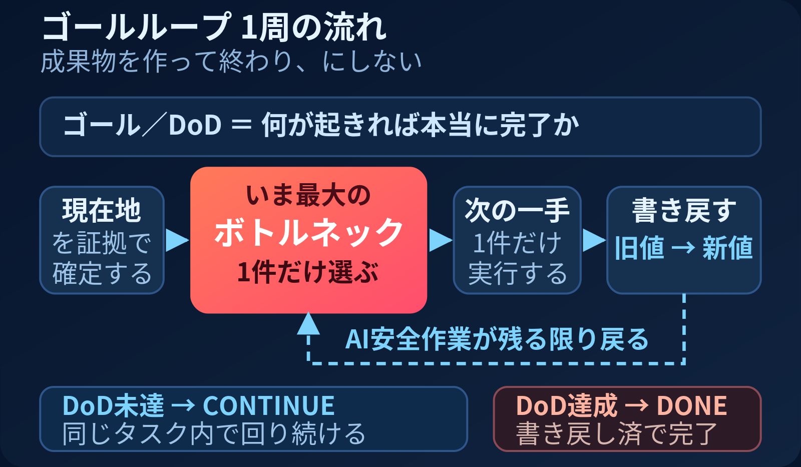
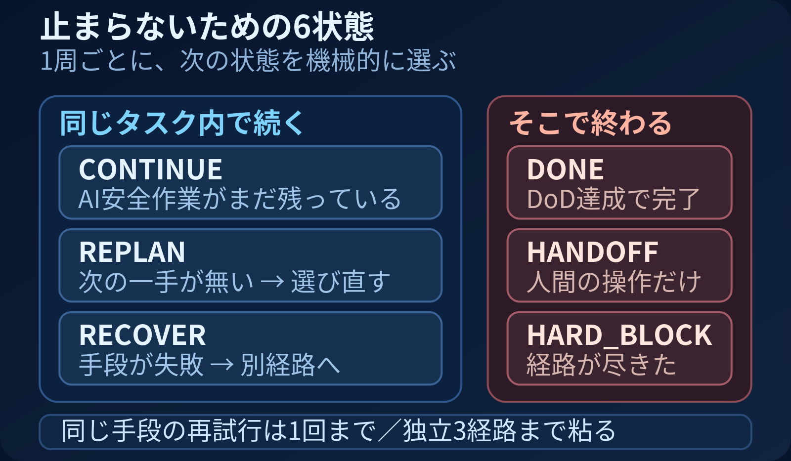

# goal-loop-standard

高処理タスクの追加品質ゲートは [QUALITY_LOOP.md](QUALITY_LOOP.md)。開始時の適用理由、固定した許容残差、独立レビュー・回帰、累積上限とcheckpointを提供する。既存 `decide` APIは変更しない。実行器・スケジューラ・課金APIは含めない。

**AI エージェントに「成果物を作って終わり」をさせないための、ゴールループ標準。**

仕様（`GOAL_LOOP.md`）と、その仕様どおりに動くかを機械で判定する実装（`goal_loop_decision.py` / `goal_loop_policy.json`）と、回帰テストがセットになっている。文章・設定・判定器が食い違ったらテストが落ちる。

---

## 1周で何をするか



理想（DoD）を先に置き、**現在地を証拠で確定 → 最大ボトルネックを1件だけ選ぶ → 次の一手を1件実行 → 旧値 → 新値を書き戻す**。DoD 未達で AI が安全にできる作業が残っている限り、同じタスクの中でボトルネックへ戻る。

ポイントは3つ。

- **ボトルネックは1件**。残作業を全部同じ優先度で並べるのは禁止。
- **書き戻しまでが1周**。実行しただけ、報告しただけでは1周が閉じていない。
- **成果物 ≠ 完了**。利用・受領・業務成果が必要な仕事は、それが確認されるまで未完了。

## 止まらないための6状態



「1周」と「1タスク」を分けているのが、この標準のいちばん実務的な部分。1周が終わるたびに人へ聞きに戻ると、エージェントは永遠に前へ進まない。そこで**毎周、次の状態を機械的に選ぶ**。

| 状態 | 選ばれる条件 | 挙動 |
|---|---|---|
| `CONTINUE` | AI が安全にできる作業がまだ残っている | 同じタスク内で続行 |
| `REPLAN` | DoD 未達だが具体的な次の一手が未選定 | 止まらず、既存情報から選び直す |
| `RECOVER` | 一手段が失敗した（soft blocker） | 同じ手段を繰り返さず別経路へ |
| `DONE` | DoD を証拠で確認し、書き戻しも完了 | 終了 |
| `HANDOFF` | AI 安全作業が0件で、実行者と行動が明確な人間操作だけが残った | 人へ渡して終了 |
| `HARD_BLOCK` | 権限・不可逆操作・必須外部依存・経路枯渇 | 安全に停止 |

回復の上限も数値で決めてある。**同じ手段の再試行は1回まで**、その後は入力・ツール・検証経路・作業順のいずれかを変えた代替へ切り替える。**独立した安全な回復手段を3つ**試して前進しない、または3つより前に全経路の不存在を証拠化し、他の AI 安全作業も0件になった時だけ hard blocker とする。

**人間待ちがあっても、独立した AI 安全作業が残っていれば止まらない。** 人間待ちは判断キューへ移し、AI が解消できる最大差分をその周回のボトルネックに選び直す。

---

## 使い方

1. `GOAL_LOOP.md` をプロジェクトへ置き、`AGENTS.md` / `CLAUDE.md` などのエントリポイントから必読参照させる。
2. タスク開始時に §3 の9項目（仕事／上位ゴール／現在ゴール／DoD／現在地／差分／最大ボトルネック／次の一手／書き戻し先）を復唱させる。これは承認待ちの停止点ではなく、作業ログへ残すための内部ゲート。
3. 各周の終わりに §7 の判定へ落とす。閾値は `goal_loop_policy.json`、判定ロジックは `goal_loop_decision.py`。
4. 単発の小タスクは §12 の最小チェックリストだけで足りる。

```python
from goal_loop_decision import decide

decide({"ai_safe_work_remaining": True})                       # -> "continue"
decide({"human_action_remaining": True})                       # -> "handoff"
decide({"dod_met": True, "writeback_complete": True})          # -> "done"
decide({"dod_met": True})                                      # -> "continue"（書き戻しが残っている）
decide({"same_method_retries": 1})                             # -> "replan"
decide({"failed_independent_approaches": 3})                   # -> "hard_block"
```

## テスト

Python 3.8 以上。**依存パッケージなし**（標準ライブラリのみ。`pytest` を使う場合だけ追加で必要）。環境によっては `python` を `python3` に読み替えてください。

```bash
python tests/test_goal_loop_autonomy.py    # 20の自走シナリオ ＋ 6の優先順位ガード
python tests/validate_goal_loop_visual.py  # 図の構図契約（横長・左→右・ボトルネック最大・最小文字サイズ）

python -m pytest tests/                    # CI から回す場合はこちら（2 passed）
```

テスト関数は `test_` 接頭辞を持たせてある。接頭辞が無いと pytest は1件も収集せず `no tests ran` を返し、**落ちていないだけの偽グリーン**になる。実際に一度踏んでいる。

図まで検証対象なのは、ASCII アートを「図解」と呼ばないためと、横長固定の図を狭幅で縮めた時に文字が 11px を切る自己矛盾を実際に踏んだため。

## 収録物

| ファイル | 役割 |
|---|---|
| `GOAL_LOOP.md` | 仕組みの正本（§0〜§12 ＋ 設計の経緯） |
| `goal_loop_policy.json` | 閾値と判定順の設定 |
| `goal_loop_decision.py` | 観測可能な状態だけから次の状態を返す判定器 |
| `tests/` | 回帰テスト2本＋pytest収集用ラッパ |
| `assets/` | 図（SVG / PNG） |

## ライセンス

MIT License（`LICENSE`）
